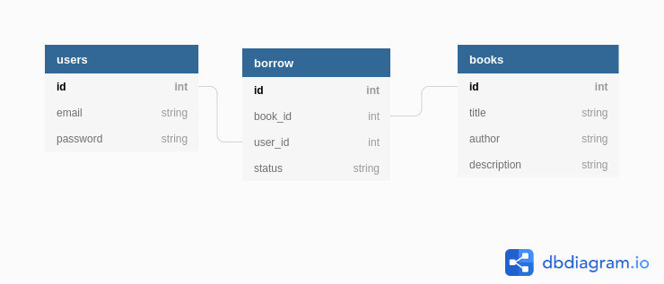

# README

This is a small library api that was used to learn Angular

## Endpoints

### Books

get /books - returns the catalog of books

get /book/:id - returns book with that id

### Users

post "/sign-up" - require email and password and returns

Example of data needed to post:

```JSON

{
  "user": {
      "email": "test@gmail.com",
      "password": "password"
  }
}

```

post "/login" - require a registered email and password and returns a jwt

Example of data needed to post:

```JSON

{
  "auth": {
      "email": "test@gmail.com",
      "password": "password"
  }
}

```
get '/user' - require and jwt and returns the user information, books and borrows

Example output:

```JSON
{
    "email": "test@user.com",
    "id": 2,
    "borrows": [
        {
            "id": 1,
            "user_id": 2,
            "book_id": 21,
            "status": "Borrowed",
            "created_at": "2020-08-20T23:09:02.797Z",
            "updated_at": "2020-08-20T23:09:02.797Z"
        },
        {
            "id": 2,
            "user_id": 2,
            "book_id": 22,
            "status": "Borrowed",
            "created_at": "2020-08-20T23:09:02.807Z",
            "updated_at": "2020-08-20T23:09:02.807Z"
        }
    ],
    "books": [
        {
            "id": 21,
            "title": "Specimen Days",
            "author": "Neville McClure",
            "description": null,
            "created_at": "2020-08-20T23:09:02.781Z",
            "updated_at": "2020-08-20T23:09:02.781Z"
        },
        {
            "id": 22,
            "title": "No Country for Old Men",
            "author": "Mr. Bobbie Fay",
            "description": null,
            "created_at": "2020-08-20T23:09:02.803Z",
            "updated_at": "2020-08-20T23:09:02.803Z"
        }
    ],
    "jwt": "JWT-INFO"
}

```


## Entity Relationship Diagram

